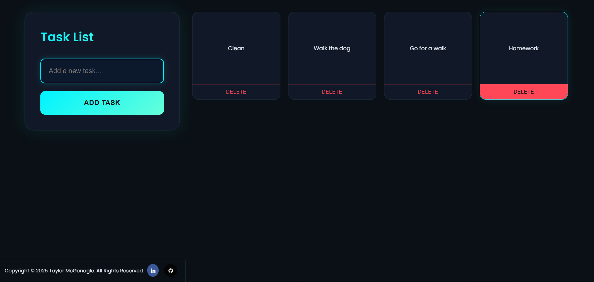

# Task List

## Live Demo
<a href="https://taylorfgh.github.io/Simple-Task-List/" target="_blank">Click here to view the project</a>


## Overview
This **Task List** is a simple yet effective to-do list application that utilizes **local storage** to keep tasks even after refreshing the page. This ensures that users don't lose their tasks and can continue where they left off.

## Features
- **Add tasks** to the list
- **Remove tasks** when completed
- **Persistent storage** using local storage to remember tasks after a refresh
- **User-friendly interface** for easy useage

## Screenshot



## How to Use
1. Open the application using the provided link.
2. Enter a task in the input field and click Add Task.
3. Click delete a task to remove it.
4. Refresh the page and the tasks will remain stored.

## Technologies Used
- **HTML** – Structure of the app
- **CSS** – Styling for a clean UI
- **JavaScript** – Functionality and local storage 

## Installation
If you want to run the project:
1. Clone the repository:
   ```sh
   git clone https://github.com/taylorfgh/Simple-Task-List.git
   ```
2. Open `index.html` in a web browser.

## Future Improvements
- Add task editing functionality
- Implement due dates and notifications
- Colour tagging for importance level

## License
This project is open-source and available under the MIT License.

